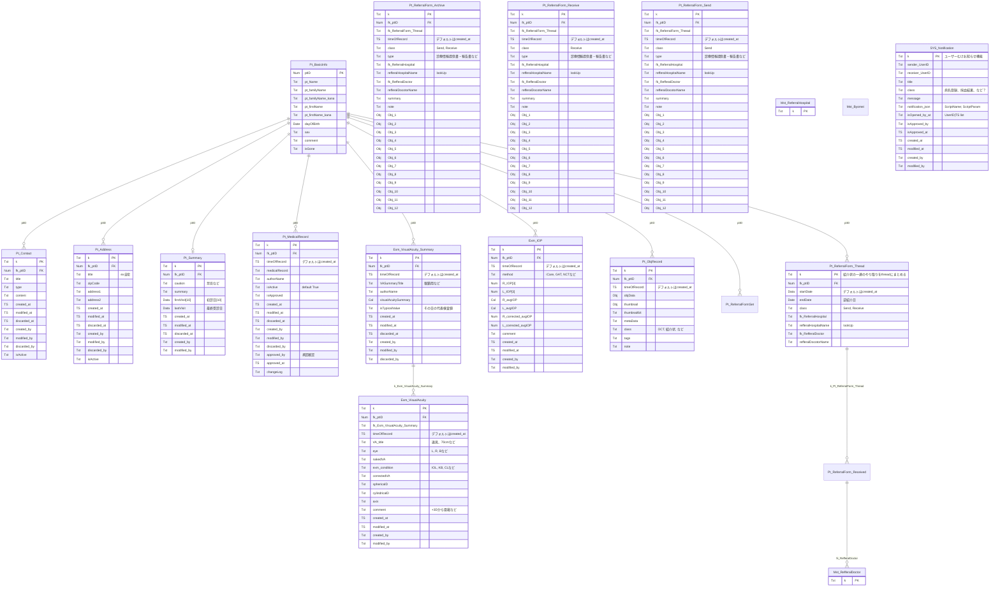

# iecHelm
iida-eye-clinic Helm FM project

-  検査はcomposite foreign key examClassと_fkを組み合わせて複数の検査テーブルに繋ぐ？
- 検査のクラス継承概念？

```mermaid
erDiagram

Pt_BasicInfo ||--o{ Pt_Contact : ptID

Pt_BasicInfo ||--o{ Pt_Address : ptID

Pt_BasicInfo ||--o| Pt_Summary : ptID

Pt_BasicInfo ||--o{ Pt_MedicalRecord : ptID

Exm_VisualAcuity_Summary ||--o{ Exm_VisualAcuity : k_Exm_VisualAcuity_Summary

Pt_BasicInfo ||--o{ Exm_VisualAcuity_Summary : ptID
Pt_BasicInfo ||--o{ Exm_IOP : ptID
Pt_BasicInfo ||--o{ Pt_ObjRecord : ptID
Pt_BasicInfo ||--o{ Pt_ReferralFormSet : ptID
Pt_BasicInfo ||--o{ Pt_ReferralForm_Thread : ptID
Pt_ReferralForm_Thread ||--o{ Pt_ReferralForm_Received : k_Pt_ReferralForm_Thread
Pt_ReferralForm_Received ||--o{ Mst_RefferalDoctor : fk_RefferalDoctor

Pt_BasicInfo {
	Num ptID PK
	Txt pt_Name
	Txt pt_familyName
	Txt pt_familyName_kana
	Txt pt_firstName
	Txt pt_firstName_kana
	Date dayOfBirth
	Txt sex
	Txt comment
	Txt isGone
	
	}
Pt_Contact {
	Txt k PK
	Num fk_ptID FK
	Txt title
	Txt type
	Txt content
	TS  created_at
	TS  modified_at
	TS  discarded_at
	Txt created_by
	Txt modified_by
	Txt discarded_by
	Txt isActive
}
Pt_Address {
	Txt k PK
	Num fk_ptID FK
	Txt title "ex自宅"
	Txt zipCode
	Txt address1
	Txt address2
	TS  created_at
	TS  modified_at
	TS  discarded_at
	Txt created_by
	Txt modified_by
	Txt discarded_by
	Txt isActive
	
}
Pt_Summary {
	Txt k PK
	Num fk_ptID FK
	Txt caution "禁忌など"
	Txt summary
	Data firstVisit[10] "初診日[10]"
	Data lastVisit "最終受診日"
	TS  created_at
	TS  modified_at
	TS  discarded_at
	Txt created_by
	Txt modified_by
}

Pt_MedicalRecord {
	Txt k PK
	Num fk_ptID FK
	TS timeOfRecord "デフォルトはcreated_at"
	Txt medicalRecord
	Txt authorName
	Txt isActive "default True"
	Txt isApproved
	TS  created_at
	TS  modified_at
	TS  discarded_at
	Txt created_by
	Txt modified_by
	Txt discarded_by
	Txt approved_by "承認確認"
	TS approved_at
	Txt changeLog
	
}
Exm_VisualAcuity_Summary {
	Txt k PK
	Num fk_ptID FK
	TS timeOfRecord "デフォルトはcreated_at"
	Txt VASummaryTitle "眼鏡用など"
	Txt authorName
	Cal visualAcuitySummary
	Txt isTypicalValue "その日の代表検査値"
	TS  created_at
	TS  modified_at
	TS  discarded_at
	Txt created_by
	Txt modified_by
	Txt discarded_by
}
Exm_VisualAcuity {
	Txt k PK
	Num fk_ptID FK
	Txt fk_Exm_VisualAcuity_Summary
	TS timeOfRecord "デフォルトはcreated_at"
	Txt VA_title "遠見、70cmなど"
	Txt eye "L, R, Bなど"
	Txt nakedVA
	Txt exm_condition "IOL, KB, CLなど"
	Txt correctedVA
	Txt	sphericalD
	Txt cylindricalD
	Txt axis
	Txt comment "+3Dから雲霧など"
	TS  created_at
	TS  modified_at
	Txt created_by
	Txt modified_by
}
Exm_IOP {
	Txt k PK
	Num fk_ptID FK
	TS timeOfRecord "デフォルトはcreated_at"
	Txt method "iCare, GAT, NCTなど"
	Num R_IOP[3]
	Num L_IOP[3]
	Cal R_avgIOP
	Cal L_avgIOP
	Num R_corrected_avgIOP
	Num L_corrected_avgIOP
	Txt comment
	TS  created_at
	TS  modified_at
	Txt created_by
	Txt modified_by
}
Pt_ObjRecord {
	Txt k PK
	Num fk_ptID FK
	TS timeOfRecord "デフォルトはcreated_at"
	Obj objData
	Obj thumbnail
	Txt thumbnail64
	Txt metaData
	Txt class "OCT, 紹介状, など"
	Txt tags
	Txt note
	
}
Pt_ReferralForm_Thread {
	Txt k PK "紹介状の一連のやり取りをthreadにまとめる"
	Num fk_ptID FK
	Data startDate "デフォルトはcreated_at"
	Date endDate "逆紹介日"
	Txt class "Send, Receive"
	Txt fk_ReferralHospital
	Txt refferalHospitalName "lookUp"
	Txt fk_RefferalDoctor
	Txt refferalDocotorName
	

}
Pt_ReferralForm_Archive {
	Txt k PK
	Num fk_ptID FK
	Txt fk_ReferralForm_Thread
	TS timeOfRecord "デフォルトはcreated_at"
	Txt class "Send, Receive"
	Txt type "診療情報提供書・報告書など"
	Txt fk_ReferralHospital
	Txt refferalHospitalName "lookUp"
	Txt fk_RefferalDoctor
	Txt refferalDocotorName
	Txt summary
	Txt note
	Obj Obj_1
	Obj Obj_2
	Obj Obj_3
	Obj Obj_4
	Obj Obj_5
	Obj Obj_6
	Obj Obj_7
	Obj Obj_8
	Obj Obj_9
	Obj Obj_10
	Obj Obj_11
	Obj Obj_12
	

}
Pt_ReferralForm_Receive {
	Txt k PK
	Num fk_ptID FK
	Txt fk_ReferralForm_Thread
	TS timeOfRecord "デフォルトはcreated_at"
	Txt class "Receive"
	Txt type "診療情報提供書・報告書など"
	Txt fk_ReferralHospital
	Txt refferalHospitalName "lookUp"
	Txt fk_RefferalDoctor
	Txt refferalDocotorName
	Txt summary
	Txt note
	Obj Obj_1
	Obj Obj_2
	Obj Obj_3
	Obj Obj_4
	Obj Obj_5
	Obj Obj_6
	Obj Obj_7
	Obj Obj_8
	Obj Obj_9
	Obj Obj_10
	Obj Obj_11
	Obj Obj_12

}
Pt_ReferralForm_Send {
	Txt k PK
	Num fk_ptID FK
	Txt fk_ReferralForm_Thread
	TS timeOfRecord "デフォルトはcreated_at"
	Txt class "Send"
	Txt type "診療情報提供書・報告書など"
	Txt fk_ReferralHospital
	Txt refferalHospitalName "lookUp"
	Txt fk_RefferalDoctor
	Txt refferalDocotorName
	Txt summary
	Txt note
	Obj Obj_1
	Obj Obj_2
	Obj Obj_3
	Obj Obj_4
	Obj Obj_5
	Obj Obj_6
	Obj Obj_7
	Obj Obj_8
	Obj Obj_9
	Obj Obj_10
	Obj Obj_11
	Obj Obj_12
	

}
Mst_ReferralHospital {
	Txt k PK

}
Mst_RefferalDoctor {
	Txt k PK
	
}
Mst_Byomei {

}
SYS_Notification {

	Txt k PK "ユーザーむけお知らせ機能"
	Txt sender_UserID
	Txt receiver_UserID
	Txt title
	Txt class "病名登録、採血結果、など？"
	Txt message
	Txt notification_json "ScriptName; ScriptParam "
	Txt isOpened_by_at "UserID|TS list"
	Txt isApproved_by
	TS isApproved_at
	TS  created_at
	TS  modified_at
	Txt created_by
	Txt modified_by
}


```
